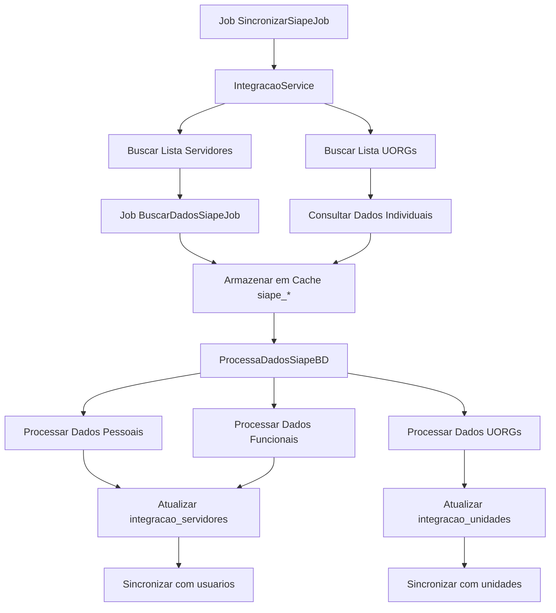

# Integração SIAPE no Sistema PGD Petrvs - Guia Completo

## Visão Geral

O SIAPE (Sistema Integrado de Administração de Recursos Humanos) é o sistema oficial do governo federal brasileiro para gestão de pessoal. No PGD Petrvs, a integração com SIAPE é fundamental para manter sincronizados os dados de servidores e estrutura organizacional.

## Arquitetura da Integração

### 1. Camadas da Integração

```
┌─────────────────────────────────────────────────────────────┐
│                    FRONTEND (Angular)                       │
│  ┌─────────────────┐  ┌─────────────────┐  ┌──────────────┐ │
│  │ Consulta CPF    │  │ Consulta Unidade│  │ Blacklists   │ │
│  │ SIAPE           │  │ SIAPE           │  │ Gestão       │ │
│  └─────────────────┘  └─────────────────┘  └──────────────┘ │
└─────────────────────────────────────────────────────────────┘
                                │
┌─────────────────────────────────────────────────────────────┐
│                    BACKEND (Laravel)                        │
│  ┌─────────────────┐  ┌─────────────────┐  ┌──────────────┐ │
│  │ Controllers     │  │ Services        │  │ Jobs/Queue   │ │
│  │ - SiapeIndiv.   │  │ - IntegracaoSiape│ │ - SincronSiape│ │
│  │ - Blacklists    │  │ - ProcessaDados │  │ - BuscarDados│ │
│  └─────────────────┘  └─────────────────┘  └──────────────┘ │
└─────────────────────────────────────────────────────────────┘
                                │
┌─────────────────────────────────────────────────────────────┐
│                    BANCO DE DADOS                           │
│  ┌─────────────────┐  ┌─────────────────┐  ┌──────────────┐ │
│  │ Tabelas Cache   │  │ Tabelas Integr. │  │ Blacklists   │ │
│  │ - siape_*       │  │ - integracoes   │  │ - siape_black│ │
│  │ - dados pessoais│  │ - integ_servidor│  │ - list_*     │ │
│  │ - dados funcion.│  │ - integ_unidades│  │              │ │
│  └─────────────────┘  └─────────────────┘  └──────────────┘ │
└─────────────────────────────────────────────────────────────┘
                                │
┌─────────────────────────────────────────────────────────────┐
│                    API SIAPE EXTERNA                        │
│  ┌─────────────────┐  ┌─────────────────┐  ┌──────────────┐ │
│  │ Conecta Gov     │  │ Web Services    │  │ Autenticação │ │
│  │ (OAuth2)        │  │ SOAP/XML        │  │ Bearer Token │ │
│  └─────────────────┘  └─────────────────┘  └──────────────┘ │
└─────────────────────────────────────────────────────────────┘
```

## Estrutura do Banco de Dados

### Tabelas de Cache SIAPE

#### siape_consultaDadosPessoais
Armazena dados pessoais dos servidores consultados no SIAPE.

```sql
CREATE TABLE siape_consultaDadosPessoais (
    id char(36) PRIMARY KEY,
    cpf varchar(14) NOT NULL,
    response longtext NOT NULL,
    data_modificacao datetime,
    processado tinyint(1) DEFAULT 0,
    created_at timestamp,
    updated_at timestamp,
    deleted_at timestamp
);
```

#### siape_consultaDadosFuncionais
Armazena dados funcionais dos servidores consultados no SIAPE.

```sql
CREATE TABLE siape_consultaDadosFuncionais (
    id char(36) PRIMARY KEY,
    cpf varchar(14) NOT NULL,
    response longtext NOT NULL,
    data_modificacao datetime,
    processado tinyint(1) DEFAULT 0,
    created_at timestamp,
    updated_at timestamp,
    deleted_at timestamp
);
```

#### siape_dadosUORG
Armazena dados das unidades organizacionais consultadas no SIAPE.

```sql
CREATE TABLE siape_dadosUORG (
    id char(36) PRIMARY KEY,
    codigo varchar(50) NOT NULL,
    response longtext NOT NULL,
    data_modificacao datetime,
    processado tinyint(1) DEFAULT 0,
    created_at timestamp,
    updated_at timestamp,
    deleted_at timestamp
);
```

### Tabelas de Integração Processada

#### integracao_servidores
Dados processados e estruturados dos servidores do SIAPE.

```sql
CREATE TABLE integracao_servidores (
    id char(36) PRIMARY KEY,
    cpf varchar(14) NOT NULL,
    nome varchar(200),
    matricula_siape varchar(20),
    cod_uorg_lotacao varchar(20),
    cod_uorg_exercicio varchar(20),
    nome_cargo varchar(100),
    situacao_funcional varchar(100),
    regime_juridico varchar(100),
    jornada_trabalho varchar(50),
    data_exercicio_cargo date,
    data_ingresso_orgao date,
    ativo tinyint(1) DEFAULT 1,
    created_at timestamp,
    updated_at timestamp
);
```

#### integracao_unidades
Dados processados e estruturados das unidades organizacionais do SIAPE.

```sql
CREATE TABLE integracao_unidades (
    id char(36) PRIMARY KEY,
    codigo_siape varchar(50) NOT NULL,
    pai_siape varchar(50),
    nomeuorg varchar(200),
    siglauorg varchar(50),
    telefone varchar(50),
    email varchar(100),
    municipio_nome varchar(100),
    municipio_uf varchar(50),
    ativa varchar(50),
    cpf_titular_autoridade_uorg varchar(14),
    cpf_substituto_autoridade_uorg varchar(14),
    created_at timestamp,
    updated_at timestamp
);
```

### Tabelas de Controle

#### integracoes
Registra execuções das rotinas de integração.

```sql
CREATE TABLE integracoes (
    id char(36) PRIMARY KEY,
    data_execucao datetime NOT NULL,
    atualizar_unidades tinyint(1) DEFAULT 0,
    atualizar_servidores tinyint(1) DEFAULT 0,
    atualizar_gestores tinyint(1) DEFAULT 0,
    resultado longtext JSON,
    entidade_id char(36),
    usuario_id char(36),
    created_at timestamp,
    updated_at timestamp
);
```

#### siape_blacklist_servidores
Lista de servidores que não devem ser processados.

```sql
CREATE TABLE siape_blacklist_servidores (
    id char(36) PRIMARY KEY,
    cpf varchar(14),
    matricula varchar(20),
    response longtext,
    inativado tinyint(1) DEFAULT 0,
    created_at timestamp,
    updated_at timestamp
);
```

## Fluxo de Integração

### 1. Processo de Sincronização Completa



### 2. Autenticação e Comunicação

#### Configuração (config/integracao.php)
```php
'siape' => [
    'url' => env('SIAPE_URL'),
    'codOrgao' => env('SIAPE_COD_ORGAO'),
    'cpf' => env('SIAPE_CPF_USUARIO'),
    'conectagov_chave' => env('CONECTAGOV_CLIENT_ID'),
    'conectagov_senha' => env('CONECTAGOV_CLIENT_SECRET'),
    'parmExistPag' => 'S',
    'parmTipoVinculo' => '1'
]
```

#### Fluxo de Autenticação
1. **OAuth2 Token**: Obtém token Bearer via Conecta Gov
2. **Headers HTTP**: Inclui CPF do usuário e token de autorização
3. **Requisição SOAP**: Envia XML estruturado para API SIAPE
4. **Resposta XML**: Processa resposta e trata erros

### 3. Estrutura de Requisição SOAP

#### Exemplo de Consulta de Dados Pessoais
```xml
<soap:Envelope xmlns:soap="http://schemas.xmlsoap.org/soap/envelope/">
    <soap:Header/>
    <soap:Body>
        <ns1:consultaDadosPessoais xmlns:ns1="http://servico.wssiapenet">
            <in>
                <parmExistPag>S</parmExistPag>
                <parmTipoVinculo>1</parmTipoVinculo>
                <codOrgao>20000</codOrgao>
                <cpf>12345678901</cpf>
            </in>
        </ns1:consultaDadosPessoais>
    </soap:Body>
</soap:Envelope>
```

## Serviços e Classes Principais

### 1. IntegracaoSiapeService
**Responsabilidade**: Orquestração geral da integração
**Localização**: `app/Services/IntegracaoSiapeService.php`

```php
class IntegracaoSiapeService extends ServiceBase
{
    // Constantes de situação funcional
    const SITUACAO_FUNCIONAL_ATIVO_EM_OUTRO_ORGAO = 8;
    const SITUACAO_FUNCIONAL_CONTRATO_TEMPORARIO = 76;
    
    // Métodos principais
    public function retornarServidores()
    public function retornarUorgs($uorgInicial = 1)
    private function processaDadosPessoais(array $pessoa, array $dadosPessoais)
    private function processaDadosFuncionais(array $dadosFuncionais)
}
```

### 2. ProcessaDadosSiapeBD
**Responsabilidade**: Processamento de dados do cache SIAPE
**Localização**: `app/Services/Siape/ProcessaDadosSiapeBD.php`

```php
class ProcessaDadosSiapeBD
{
    public function dadosServidor(): array
    public function dadosUorg(): array
    public function processaDadosPessoais(string $cpf, string $dadosPessoais): array
    public function processaDadosFuncionais(string $cpf, string $dadosFuncionais): array
    private function cpfNaBlackList(string $cpf): bool
}
```

### 3. SiapeService (Abstrato)
**Responsabilidade**: Comunicação com API SIAPE
**Localização**: `app/Services/Siape/Consulta/SiapeService.php`

```php
abstract class SiapeService extends SiapeBaseService
{
    use SiapeGetToken, SiapeConfig;
    
    public function getHeaders()
    public function buscar($params = []): string|bool
}
```

## Jobs e Processamento Assíncrono

### 1. SincronizarSiapeJob
**Função**: Executa sincronização completa de todas as entidades
**Queue**: `siape_queue`
**Timeout**: Ilimitado

```php
class SincronizarSiapeJob implements ShouldQueue
{
    public function handle(IntegracaoService $integracaoService)
    {
        $entidades = Entidade::all();
        foreach ($entidades as $entidade) {
            $inputs = [
                'entidade' => $entidade->id,
                'unidades' => true,
                'servidores' => true,
                'gestores' => true,
            ];
            $integracaoService->sincronizar($inputs);
        }
    }
}
```

### 2. BuscarDadosSiapeJob
**Função**: Busca dados individuais de servidores/unidades
**Processamento**: Consultas específicas por CPF ou código UORG

## Sistema de Blacklist

### Propósito
- **Servidores**: CPFs que retornam erro ou não existem no SIAPE
- **Unidades**: Códigos UORG inválidos ou inativos
- **Matrículas**: Matrículas inativas de servidores com múltiplos vínculos

### Funcionamento
1. **Detecção Automática**: Erros SOAP geram entradas na blacklist
2. **Exclusão do Processamento**: Itens na blacklist são ignorados
3. **Gestão Manual**: Interface para adicionar/remover itens
4. **Reativação**: Processo para reativar itens quando necessário

## Tratamento de Erros

### Tipos de Erro Comuns

#### 1. Erros de Conectividade
```php
// Retry automático com backoff
$response = Http::withHeaders($headers)
    ->retry(2, 1000, throw: false)
    ->post($url);
```

#### 2. Erros SOAP Fault
```php
if ($response->failed()) {
    $responseXml = new SimpleXMLElement($xml);
    $fault = $responseXml->xpath('//soap:Fault');
    throw new ErrorDataSiapeFaultCodeException($fault[0]->faultstring);
}
```

#### 3. Dados Inexistentes
```php
// Adiciona automaticamente à blacklist
if (in_array($faultString, Erros::getFaultStringNaoExistemDados())) {
    SiapeBlackListServidor::firstOrCreate(['cpf' => $cpf]);
}
```

## Sincronização com Sistema Local

### Mapeamento Servidor SIAPE → Usuario Sistema
```php
// Campos principais mapeados
$usuario = [
    'cpf' => $dadosSiape['cpf'],
    'nome' => $dadosSiape['nome'],
    'matricula' => $dadosSiape['matriculaSiape'],
    'situacao_funcional' => $dadosSiape['codSitFuncional'],
    'lotacao_id' => $unidadeLocal->id, // Mapeado por código UORG
];
```

### Mapeamento Unidade SIAPE → Unidade Sistema
```php
// Campos principais mapeados
$unidade = [
    'codigo' => $dadosSiape['codUorg'],
    'nome' => $dadosSiape['nomeExtendido'],
    'sigla' => $dadosSiape['siglaUorg'],
    'unidade_pai_id' => $unidadePai->id, // Hierarquia
    'gestor_id' => $gestorTitular->id,
    'gestor_substituto_id' => $gestorSubstituto->id,
];
```

## Monitoramento e Logs

### Logs Específicos SIAPE
```php
// Facade personalizada para logs SIAPE
SiapeLog::info('Servidor processado: ' . $cpf);
SiapeLog::error('Erro ao processar: ' . $erro);
```

### Métricas de Integração
- **Servidores processados**: Quantidade por execução
- **Unidades atualizadas**: Quantidade por execução
- **Erros encontrados**: Tipos e frequência
- **Tempo de execução**: Performance da sincronização

## Comandos Artisan

### Execução Manual
```bash
# Sincronização completa
php artisan siape:executar

# Consulta individual por CPF
php artisan siape:individual --cpf=12345678901

# Inativação de usuários
php artisan siape:inativar-usuarios

# Inativação de unidades
php artisan siape:inativar-unidades
```

## Configurações de Ambiente

### Variáveis Necessárias
```env
# URL da API SIAPE
SIAPE_URL=https://api.siape.gov.br

# Código do órgão no SIAPE
SIAPE_COD_ORGAO=20000

# CPF do usuário autorizado
SIAPE_CPF_USUARIO=12345678901

# Credenciais Conecta Gov
CONECTAGOV_CLIENT_ID=client_id
CONECTAGOV_CLIENT_SECRET=client_secret
```

## Considerações de Performance

### Otimizações Implementadas
1. **Cache Local**: Dados ficam em cache para reprocessamento
2. **Processamento em Lote**: Múltiplos registros por requisição
3. **Queue Dedicada**: Fila específica para jobs SIAPE
4. **Índices de Banco**: Otimização de consultas frequentes
5. **Blacklist**: Evita reprocessamento de erros conhecidos

### Limitações e Cuidados
- **Rate Limiting**: API SIAPE tem limites de requisições
- **Timeout**: Operações podem ser longas para órgãos grandes
- **Memória**: Processamento de grandes volumes requer recursos
- **Consistência**: Dados podem estar desatualizados entre sincronizações

## Troubleshooting

### Problemas Comuns

#### 1. Token Expirado
**Sintoma**: Erro 401 Unauthorized
**Solução**: Verificar credenciais Conecta Gov e renovar token

#### 2. CPF Não Encontrado
**Sintoma**: Fault code com "dados não encontrados"
**Solução**: Verificar se CPF existe no SIAPE do órgão

#### 3. Unidade Inativa
**Sintoma**: UORG retorna erro ou dados vazios
**Solução**: Verificar se unidade ainda está ativa no SIAPE

#### 4. Múltiplas Matrículas
**Sintoma**: Servidor com várias matrículas ativas/inativas
**Solução**: Sistema gerencia automaticamente via blacklist

### Logs para Diagnóstico
```bash
# Logs gerais do Laravel
tail -f storage/logs/laravel.log

# Logs específicos SIAPE
tail -f storage/logs/siape.log

# Jobs em execução
php artisan queue:work --queue=siape_queue --verbose
```

## Conclusão

A integração SIAPE no PGD Petrvs é um sistema robusto que mantém sincronizados os dados oficiais de servidores e estrutura organizacional. Com cache local, processamento assíncrono e tratamento inteligente de erros, garante que o sistema tenha sempre dados atualizados e confiáveis do sistema oficial do governo federal.

A arquitetura modular permite extensões futuras e a separação clara de responsabilidades facilita manutenção e troubleshooting. O sistema de blacklist e logs detalhados proporcionam visibilidade completa do processo de integração.