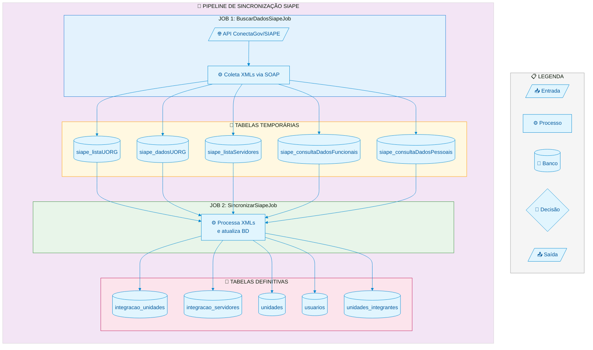
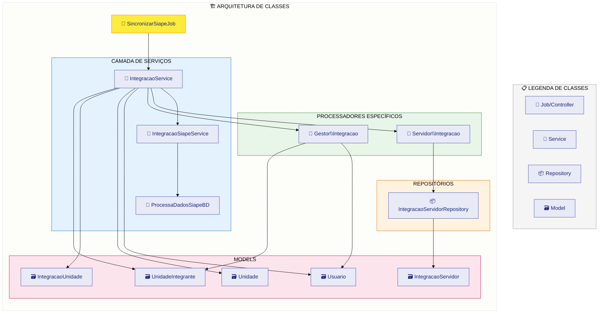
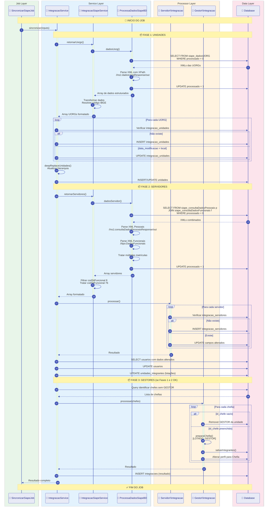
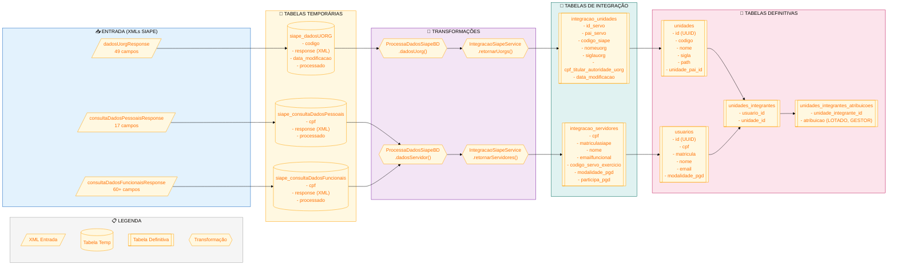
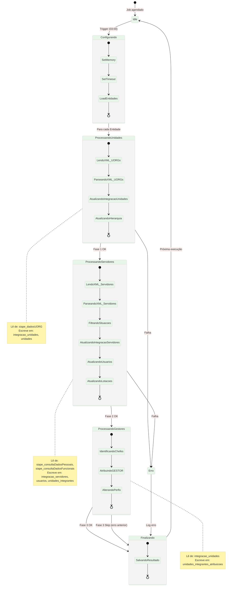
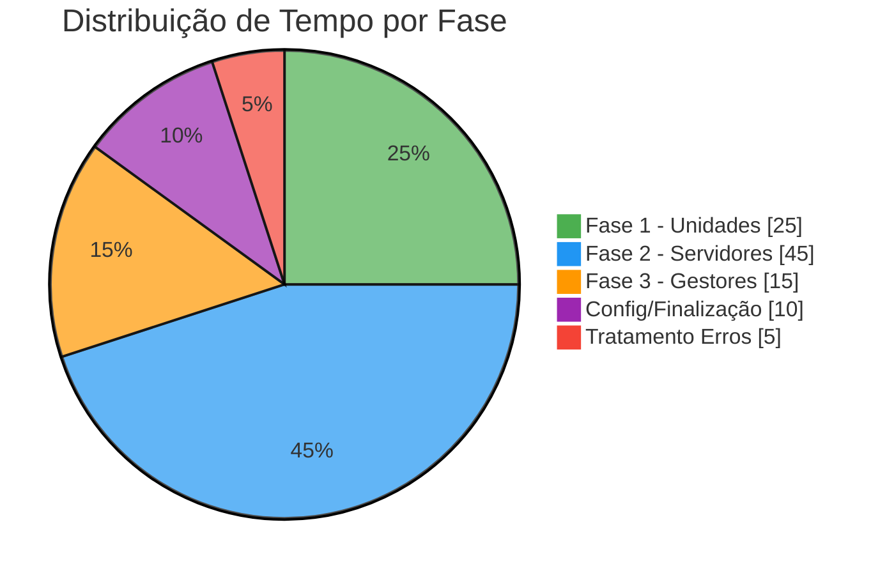

# Diagramas do Fluxo SincronizarSiapeJob

Este documento contém diagramas Mermaid que representam o fluxo completo do job de sincronização SIAPE.

## 1. Visão Geral do Pipeline



## 2. Arquitetura de Classes



## 3. Fluxo Detalhado do SincronizarSiapeJob

```mermaid
%%{init: {'theme': 'base', 'themeVariables': { 'primaryColor': '#e1f5fe', 'primaryTextColor': '#01579b', 'primaryBorderColor': '#0288d1', 'lineColor': '#424242'}}}%%

flowchart TB
    subgraph LEGEND["📋 LEGENDA"]
        direction LR
        LE1["🟢 Início/Fim"]
        LE2["🔵 Processo"]
        LE3["🟡 Decisão"]
        LE4["🟣 Fase"]
        LE5["🔴 Erro"]
    end

    START(("🟢 START"))

    subgraph CONFIG["⚙️ CONFIGURAÇÃO INICIAL"]
        C1["memory_limit = -1"]
        C2["timeout = 0"]
        C3["max_execution_time = 30min"]
        C1 --> C2 --> C3
    end

    LOAD_ENT["📋 Carregar todas Entidades"]

    subgraph LOOP["🔄 PARA CADA ENTIDADE"]
        direction TB

        INPUT["📥 inputs = {\n  unidades: true,\n  servidores: true,\n  gestores: true\n}"]

        subgraph FASE1["🟣 FASE 1: UNIDADES"]
            direction TB
            F1_START{"unidades\n== true?"}
            F1_READ["📖 ProcessaDadosSiapeBD\n.dadosUorg()"]
            F1_PARSE["🔄 Parse XML\nXPath: //ns1:dadosUorgResponse/out"]
            F1_TRANS["🔄 IntegracaoSiapeService\n.retornarUorgs()"]
            F1_LOOP["🔁 Para cada UORG"]
            F1_CHECK{"Existe em\nintegracao_\nunidades?"}
            F1_INSERT["➕ INSERT\nintegracao_unidades"]
            F1_UPDATE{"data_mod\n> local?"}
            F1_UPD["🔄 UPDATE\nintegracao_unidades"]
            F1_SKIP["⏭️ Skip"]
            F1_HIER["🏗️ Atualizar hierarquia\ntabela unidades"]
            F1_RESULT["✅ Resultado: Sucesso"]
            F1_ERROR["❌ Resultado: ERRO"]

            F1_START -->|Sim| F1_READ
            F1_START -->|Não| F1_RESULT
            F1_READ --> F1_PARSE --> F1_TRANS --> F1_LOOP
            F1_LOOP --> F1_CHECK
            F1_CHECK -->|Não| F1_INSERT
            F1_CHECK -->|Sim| F1_UPDATE
            F1_UPDATE -->|Sim| F1_UPD
            F1_UPDATE -->|Não| F1_SKIP
            F1_INSERT --> F1_HIER
            F1_UPD --> F1_HIER
            F1_SKIP --> F1_HIER
            F1_HIER --> F1_RESULT
        end

        subgraph FASE2["🟣 FASE 2: SERVIDORES"]
            direction TB
            F2_START{"servidores\n== true?"}
            F2_READ["📖 ProcessaDadosSiapeBD\n.dadosServidor()"]
            F2_JOIN["🔗 JOIN pessoais + funcionais\nWHERE processado = 0"]
            F2_TRANS["🔄 IntegracaoSiapeService\n.retornarServidores()"]
            F2_FILTER{"codSitFuncional\n== 8?"}
            F2_IGNORE["⏭️ Ignorar\n(ATIVO_EM_OUTRO_ORGAO)"]
            F2_CT{"codSitFuncional\n== 76?"}
            F2_SIGLA["🔍 Buscar unidade\npor siglaUorgLotacao"]
            F2_PROC["🔧 Servidor\\Integracao\n.processar()"]
            F2_USRS["🔄 Atualizar usuarios\ne lotações"]
            F2_RESULT["✅ Resultado: Sucesso"]
            F2_ERROR["❌ Resultado: ERRO"]

            F2_START -->|Sim| F2_READ
            F2_START -->|Não| F2_RESULT
            F2_READ --> F2_JOIN --> F2_TRANS --> F2_FILTER
            F2_FILTER -->|Sim| F2_IGNORE
            F2_FILTER -->|Não| F2_CT
            F2_CT -->|Sim| F2_SIGLA --> F2_PROC
            F2_CT -->|Não| F2_PROC
            F2_PROC --> F2_USRS --> F2_RESULT
        end

        CHECK_PHASES{"Fase 1 == Sucesso\nE\nFase 2 == Sucesso?"}

        subgraph FASE3["🟣 FASE 3: GESTORES"]
            direction TB
            F3_QUERY["🔍 Query: identificar\nusuários sem GESTOR"]
            F3_LOOP["🔁 Para cada chefia"]
            F3_CHEFE{"id_chefe\nvazio?"}
            F3_REMOVE["🗑️ Remover GESTOR\natual da unidade"]
            F3_PREP["📋 Preparar atribuições:\n[LOTADO, GESTOR]"]
            F3_SAVE["💾 salvarIntegrantes()"]
            F3_PERFIL["👤 Alterar perfil\npara 'Chefia'"]
            F3_RESULT["✅ Resultado: Sucesso"]

            F3_QUERY --> F3_LOOP --> F3_CHEFE
            F3_CHEFE -->|Sim| F3_REMOVE
            F3_CHEFE -->|Não| F3_PREP
            F3_REMOVE --> F3_RESULT
            F3_PREP --> F3_SAVE --> F3_PERFIL --> F3_RESULT
        end

        SKIP_F3["⏭️ Fase 3 não executada"]

        INPUT --> FASE1
        FASE1 --> FASE2
        FASE2 --> CHECK_PHASES
        CHECK_PHASES -->|Sim| FASE3
        CHECK_PHASES -->|Não| SKIP_F3
    end

    SAVE_RESULT["💾 Salvar resultado\nna tabela integracoes"]

    END_(("🟢 END"))

    START --> CONFIG --> LOAD_ENT --> LOOP
    FASE3 --> SAVE_RESULT
    SKIP_F3 --> SAVE_RESULT
    SAVE_RESULT --> END_

    style LEGEND fill:#f5f5f5,stroke:#9e9e9e
    style CONFIG fill:#e0f7fa,stroke:#00838f
    style FASE1 fill:#e3f2fd,stroke:#1565c0
    style FASE2 fill:#e8f5e9,stroke:#2e7d32
    style FASE3 fill:#fff3e0,stroke:#ef6c00
    style START fill:#c8e6c9,stroke:#2e7d32
    style END_ fill:#c8e6c9,stroke:#2e7d32
```



## 4. Diagrama de Sequência - Interação entre Classes



## 5. Fluxo de Dados - Entity Relationship



## 6. Tratamento de Casos Especiais

```mermaid
%%{init: {'theme': 'base', 'themeVariables': { 'primaryColor': '#ffebee', 'primaryTextColor': '#b71c1c', 'primaryBorderColor': '#c62828'}}}%%

flowchart TB
    subgraph LEGEND["📋 LEGENDA"]
        direction LR
        L1["✅ Sucesso"]
        L2["⚠️ Tratamento Especial"]
        L3["❌ Erro/Blacklist"]
    end

    subgraph CASOS["⚠️ CASOS ESPECIAIS"]
        direction TB

        subgraph SIT_FUNC["SITUAÇÃO FUNCIONAL"]
            SF1{"codSitFuncional?"}
            SF2["⚠️ Código 8\nATIVO_EM_OUTRO_ORGAO"]
            SF3["⚠️ Código 76\nCONTRATO_TEMPORARIO"]
            SF4["✅ Outros códigos\nProcessar normalmente"]
            SF5["❌ Ignorar servidor"]
            SF6["🔍 Buscar unidade\npor siglaUorgLotacao"]

            SF1 -->|8| SF2 --> SF5
            SF1 -->|76| SF3 --> SF6
            SF1 -->|Outros| SF4
        end

        subgraph MULT_MAT["MÚLTIPLAS MATRÍCULAS"]
            MM1{"CPF com\nmúltiplas\nmatrículas?"}
            MM2["📋 Obter matrículas\nativas do XML"]
            MM3{"Matrícula\nno XML?"}
            MM4["✅ Ativar matrícula"]
            MM5["❌ Adicionar à blacklist"]

            MM1 -->|Sim| MM2 --> MM3
            MM1 -->|Não| MM4
            MM3 -->|Sim| MM4
            MM3 -->|Não| MM5
        end

        subgraph EMAIL_DUP["EMAIL DUPLICADO"]
            ED1{"Email já\nexiste?"}
            ED2["⚠️ Gerar email fake:\nmatricula@petrvs.gov.br"]
            ED3{"Ainda\nduplicado?"}
            ED4["⚠️ Usar UUID:\nuuid@petrvs.gov.br"]
            ED5["✅ Usar email\noriginal"]

            ED1 -->|Sim| ED2 --> ED3
            ED1 -->|Não| ED5
            ED3 -->|Sim| ED4
            ED3 -->|Não| ED5
        end

        subgraph HIERARQUIA["HIERARQUIA DE UNIDADES"]
            HI1{"Unidade\nexiste?"}
            HI2["➕ INSERT nova unidade\ncom path hierárquico"]
            HI3{"Pai\nmudou?"}
            HI4["🔄 UPDATE path\n+ paths dos filhos"]
            HI5["🔄 UPDATE apenas\nnome, sigla, cidade"]

            HI1 -->|Não| HI2
            HI1 -->|Sim| HI3
            HI3 -->|Sim| HI4
            HI3 -->|Não| HI5
        end

        subgraph BLACKLIST["BLACKLIST"]
            BL1{"SOAP Fault\ncódigo 0002?"}
            BL2["❌ Adicionar CPF/código\nà blacklist"]
            BL3["✅ Processar\nnormalmente"]
            BL4["📋 Guardar XML\nde resposta"]

            BL1 -->|Sim| BL2 --> BL4
            BL1 -->|Não| BL3
        end
    end

    style LEGEND fill:#f5f5f5,stroke:#9e9e9e
    style SIT_FUNC fill:#e3f2fd,stroke:#1565c0
    style MULT_MAT fill:#fff3e0,stroke:#ef6c00
    style EMAIL_DUP fill:#f3e5f5,stroke:#7b1fa2
    style HIERARQUIA fill:#e8f5e9,stroke:#2e7d32
    style BLACKLIST fill:#ffebee,stroke:#c62828
```



## 7. Timeline de Execução

```mermaid
%%{init: {'theme': 'base'}}%%

gantt
    title Timeline de Execução - SincronizarSiapeJob
    dateFormat HH:mm
    axisFormat %H:%M

    section Configuração
    Inicialização (memory, timeout)      :a1, 03:00, 1m
    Carregar Entidades                   :a2, after a1, 1m

    section Fase 1 - Unidades
    Ler siape_dadosUORG                  :b1, after a2, 2m
    Parse XMLs                           :b2, after b1, 3m
    Atualizar integracao_unidades        :b3, after b2, 3m
    Atualizar hierarquia unidades        :b4, after b3, 2m

    section Fase 2 - Servidores
    Ler siape_consultaDados*             :c1, after b4, 2m
    Parse XMLs (JOIN)                    :c2, after c1, 4m
    Atualizar integracao_servidores      :c3, after c2, 3m
    Atualizar usuarios                   :c4, after c3, 3m
    Atualizar lotações                   :c5, after c4, 2m

    section Fase 3 - Gestores
    Query identificar chefes             :d1, after c5, 1m
    Atribuir GESTOR                      :d2, after d1, 2m
    Alterar perfis                       :d3, after d2, 1m

    section Finalização
    Salvar resultado                     :e1, after d3, 1m
```



## 8. Diagrama de Estados



## 9. Resumo Visual Compacto



---

## Notas de Uso

### Renderização dos Diagramas

Para visualizar estes diagramas:

1. **GitHub/GitLab**: Renderiza automaticamente em arquivos `.md`
2. **VS Code**: Instale extensão "Markdown Preview Mermaid Support"
3. **Mermaid Live Editor**: https://mermaid.live
4. **Documentação**: Integre com ferramentas como Docusaurus, MkDocs

### Personalização

Os diagramas usam a configuração `init` do Mermaid para personalizar cores e estilos. Modifique o bloco `%%{init:...}%%` para ajustar às cores do seu projeto.

### Exportação

Para exportar como imagem:
```bash
# Usando mermaid-cli
npx @mermaid-js/mermaid-cli mmdc -i diagrama.md -o diagrama.png
```

---

*Diagramas criados em: 2025-12-17*
*Baseados na análise do código: SincronizarSiapeJob, IntegracaoService, ProcessaDadosSiapeBD*
